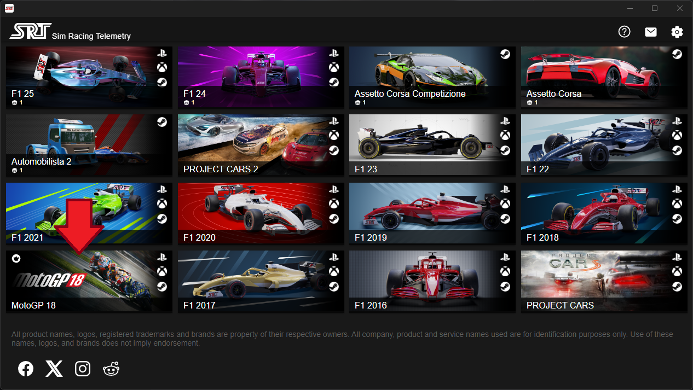
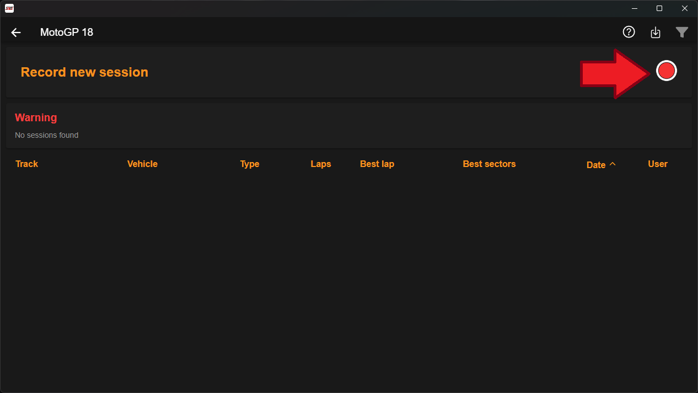
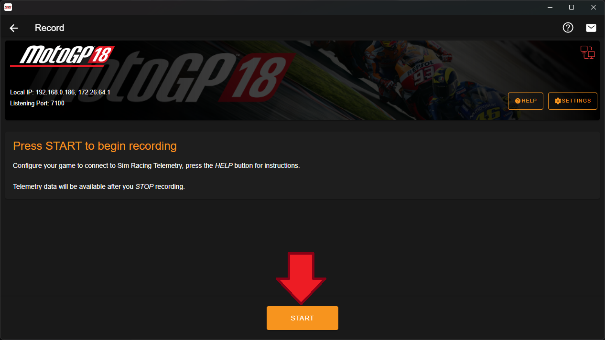
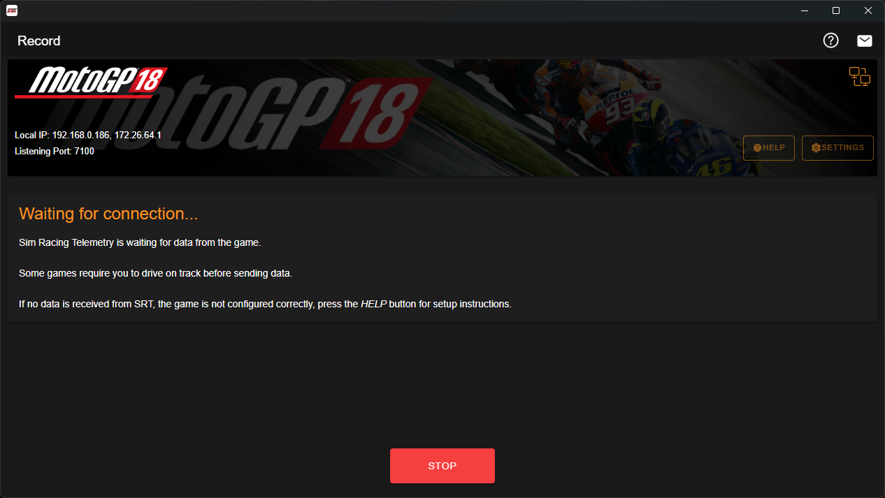
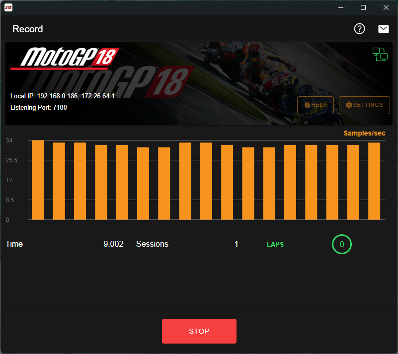
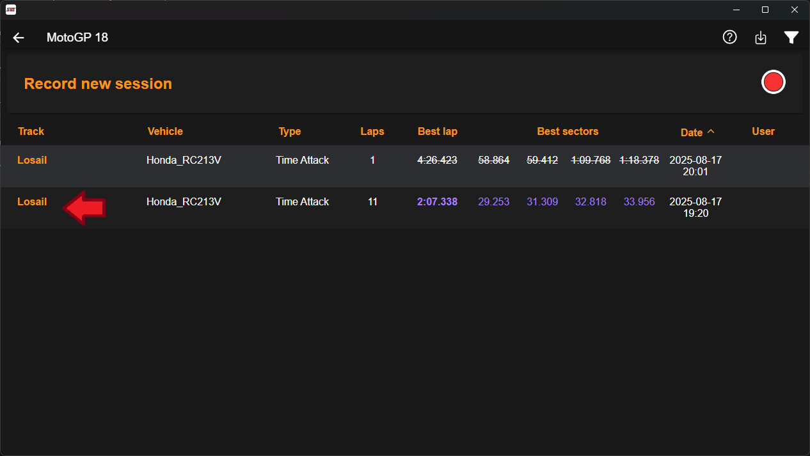
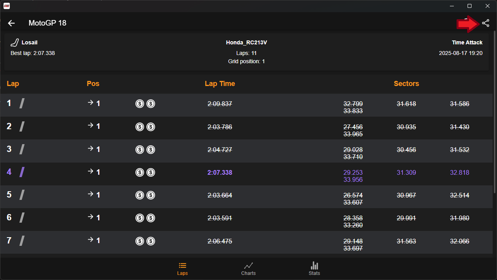
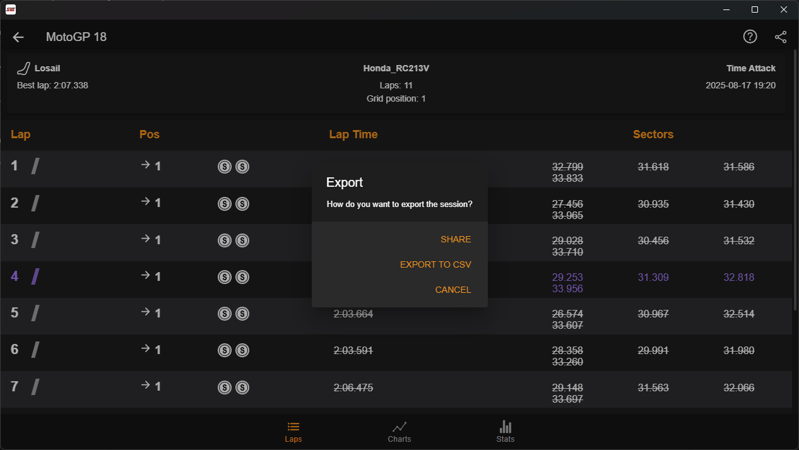

# How to use Game integration with SRT (Sim Racing Telemetry)
## Installation:
- Buy and download MotoGP18 from steam: [MotoGP 18 Steam Page](https://store.steampowered.com/app/775900/MotoGP18/)
- Download Sim Racing Telemetry(SRT) from steam: [SRT Steam Page](https://store.steampowered.com/app/845210/Sim_Racing_Telemetry/)
- Buy the MotoGP18 DLC for SRT from steam: [Moto GP DLC](https://store.steampowered.com/app/885660/Sim_Racing_Telemetry__MotoGP_18/?curator_clanid=32708130)

## How to record laps in MotoGP
- Launch MotoGP18, navigate to any race you wish to do and enter the race.
- Launch SRT.
- Click on the MotoGP18 tile (Indicated by the arrow):  

- Click on the Record new Session Button (Indecated by the arrow):  

- Click on the Start Button (Indecated by the arrow):  

- Go back to MotoGP and start your race  

- While Racing you will see SRT recording your lap:  

- Once you are done with the race click the stop button in SRT

## How to export the recorded race from SRT to CSV:
- Click on the session you would like to export:  

- Click on the share button on the top right of the screen (Indicated by the arrow):  

- Click on the export to CSV option:  

- Save it to your disk from the file menu that popped up.