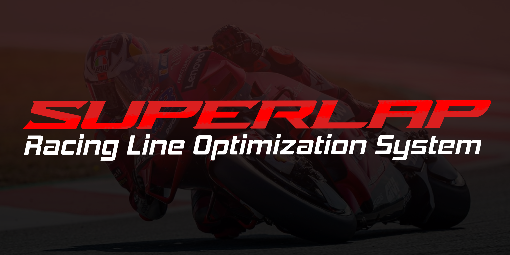

    

    

    <!-- GitHub Actions Build --> 
    <!-- Code Coverage (Codecov) --> 
    <!-- Requirements (shields.io custom) --> 
    <!-- GitHub Issues --> 
    <!-- Uptime Robot (customize as needed) --> 

    <!-- Python --> 
    <!-- Unity --> 
    <!-- Node.js --> 
    <!-- Express.js --> 
    <!-- Git --> 
    <!-- !-- Docker ->  -->

<h2 style="font-weight: bold; color: #E54B4B;">Project Description</h2>
Hello! We’re Quintessential, the creators of the upcoming SuperLap Racing Line Optimization System. We’re developing a smart tool that will help superbike riders discover the fastest racing line on any track using Reinforcement Learning and Computer Vision.
Our system will take a top-down track image, learn through trial and error, and generate a visual map of the optimal path—bringing pro-level telemetry insights to students, amateur racers, and motorsport enthusiasts.
By simulating AI-driven racing strategies, we aim to make high-performance insights accessible to everyone, improving training and reducing guesswork. Because in racing, every millisecond will matter.

<h2 style="font-weight: bold; color: #E54B4B;">Table of Contents</h2>

- [Project Description](#project-description)
- [Table of Contents](#table-of-contents)
- [Demo Links](#demo-links)
- [Project Management](#project-management)
- [Documentation](#documentation)
- [Meet the Quintessential Team](#meet-the-quintessential-team)

<h2 style="font-weight: bold; color: #E54B4B;">Demo Links</h2>

🔹 [Demo 1 Video](https://github.com/)  
🔹 [Demo 1 Presentation](https://github.com/)

<h2 style="font-weight: bold; color: #E54B4B;">Documentation</h2>

+ [Project Board](https://github.com/orgs/COS301-SE-2025/projects/227?query=is%3Aopen)
- [Functional Requirements (SRS)](docs/FunctionalRequirements.pdf)
- [Architectural Requirements](docs/ArchitecturalRequirements.pdf)
+ [Architecture Diagram](docs/ArchitectureDiagram.pdf)
+ [Class Diagram](docs/ClassDiagram.pdf)
+ [Deployment Diagram](docs/DeploymentDiagram.pdf)
- [Installation Manual](docs/InstallationManual.pdf)
- [Technical Installation Manual](docs/TechnicalInstallationManual.pdf)
- [User Manual](docs/UserManualnual.pdf)
+ [Machine Learning Specification](docs/MachineLearningSpecification.pdf)
+ [API Documentation](docs/APIDocumentation.pdf)
- [Coding Standards](docs/CodingStandards.pdf)
- [Testing Policy](docs/TestingPolicy.pdf)
- [Contributing](docs/Contributing.pdf)

<h2 style="font-weight: bold; color: #E54B4B;">Meet the Quintessential Team</h2>

| Name | Description | GitHub      | LinkedIn |
|-------|-------------|-----------|-----------|
| Amber Ann Werner   | Third-year Computer Science student with experience in C++, Python, and Node.js. Passionate about software engineering, debugging, and testing. | [GitHub](https://github.com/Amber21457752) | [LinkedIn](https://za.linkedin.com/in/amber-ann-werner-5087b2258?trk=people_directory) |
| Milan Kruger   | Final-year Computer Science student with expertise in C++, Java, and game development. Interested in AI, ML, and building robust systems. | [GitHub](https://example.com/api) | [LinkedIn](https://example.com/api) |
| Qwinton Knocklein   | I am a final-year BSc Information and Knowledge Systems student with a strong foundation in full-stack development, backend systems, and a deep passion for AI-driven solutions. I’ve played a key role in the backend development of a custom database management system and have built several applications, games, and websites that reflect my interest in both practical and creative aspects of development. While most proficient in Java and C++, I also have experience with Python, React, Angular, and the .NET framework. I’ve used tools like Postman, Git, and Unity extensively and am eager to dive deeper into emerging technologies like PyTorch and OpenCV. My ability to learn quickly and adapt to new technologies positions me well for the image processing and reinforcement learning components of this project. Although I don’t have formal tech industry work experience, I currently work at the university library, where I interact with diverse people daily. This role has sharpened my communication and collaboration skills—qualities I bring into every team project I’m part of. On the SuperLap Racing Line Optimization System, I am most excited to contribute to backend development and AI integration, particularly the reinforcement learning agent and the track analysis pipeline. My personal goal is to deepen my technical knowledge in machine learning, image processing, and cloud-based development, while delivering robust, scalable systems to support the rest of the team. As someone who has always been passionate about racing and F1, this project is especially exciting to me. The opportunity to build something that brings racing intelligence to life is not just a technical challenge, but a dream project that combines my interests and skills.  | [GitHub](https://example.com/api) | [LinkedIn](https://example.com/api) |
| Sean van der Merwe   | I am a final-year BSc Computer Science student. I’m a curious programmer, always looking for my next programming project to learn new things. I have experience with C++, Java, Python, Nodejs. I’m Excited to delve into AI and learn more about deep learning and image processing. I learn quickly, and excel at doing research on projects, and how to implement features efficiently. I developed the database system and business management software for Simulator Cave. Thus, I have experience with working with clients and delivering a quality product based off their expectations. On the SuperLap Racing Line Optimization System, I am excited to work with proper machine learning algorithms, and use image processing to gather data. I’m excited to see the improvements to the model and learn from each issue that might arise. | [GitHub](https://example.com/api) | [LinkedIn](https://example.com/api) |
| Simon van der Merwe   | I am a third-year Computer and Data Science student with academic experience in various programming languages, including C++, Java, JavaScript/TypeScript, and Python. In my personal time, I find myself working on projects mostly using Rust, Go, and Dart, whether that be for game development using bevy, backend work or frontend development with Flutter. Based on this background, I believe my skills in web development (JavaScript/TypeScript), Python, and my prior C# game development experience in particular are relevant to this project. During university recesses, I participate in voluntary vacation work at BBD Software. This role has provided invaluable experience in a fast-paced environment, significantly improving my communication and collaboration skills within both large and small teams. Furthermore, it has given me direct exposure to client interactions. I consider myself a fast learner and an effective problem-solver, ready for all challenges, and look forward to working on this project. | [GitHub](https://example.com/api) | [LinkedIn](https://example.com/api) |

