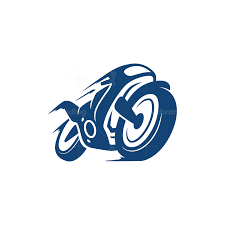
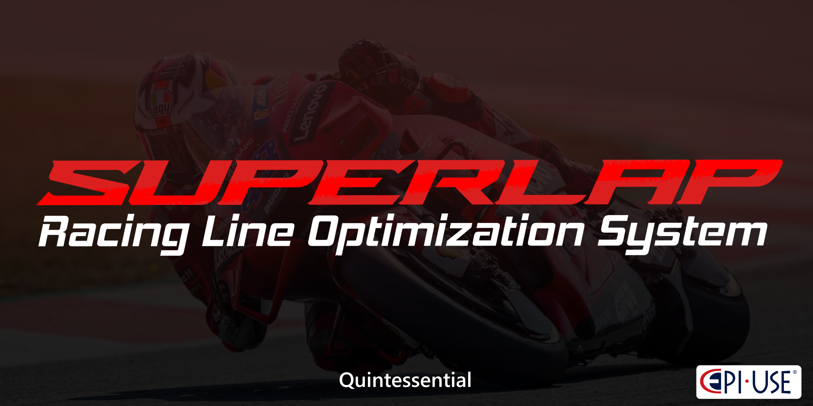
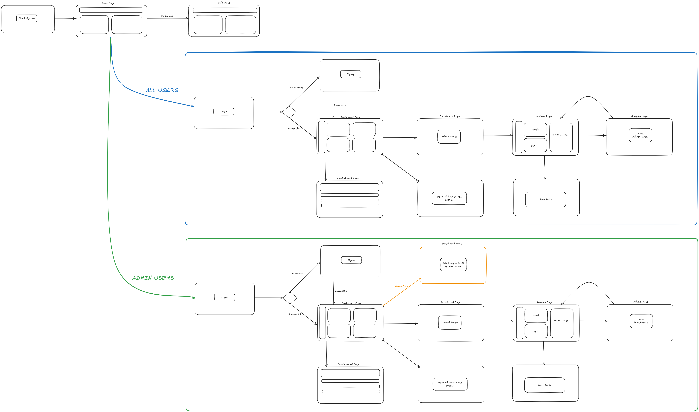

    

    

    <!-- GitHub Actions Build --> 
    <!-- C# Lint --> 
    <!-- Unity Tests --> 
    <!-- Unity Test Coverage -->     <!-- Requirements (shields.io custom) --> 
    <!-- GitHub Issues --> 
    <!-- Uptime Robot (customize as needed) -->
    

<!-- 
 -->

    <!-- Python --> 
    <!-- Shell --> 
    <!-- Unity --> 
    <!-- Node.js --> 
    <!-- Express.js --> 
    <!-- Git --> 
    <!-- Docker --> 
    <!--!C# --> 
    <!-- ShaderLab--> 
    <!-- HLSL --> 

Website at: [https://cos301-se-2025.github.io/SuperLap/](https://cos301-se-2025.github.io/SuperLap/)

<h2 style="font-weight: bold; color: #E54B4B;">Project Description</h2>
Hello! We’re Quintessential, the creators of the upcoming SuperLap Racing Line Optimization System. We’re developing a smart tool that will help superbike riders discover the fastest racing line on any track using Reinforcement Learning and Computer Vision.
Our system will take a top-down track image, learn through trial and error, and generate a visual map of the optimal path—bringing pro-level telemetry insights to students, amateur racers, and motorsport enthusiasts.
By simulating AI-driven racing strategies, we aim to make high-performance insights accessible to everyone, improving training and reducing guesswork. Because in racing, every millisecond will matter.

<h2 style="font-weight: bold; color: #E54B4B;">Table of Contents</h2>

- [Project Description](#project-description)
- [Table of Contents](#table-of-contents)
- [Demo Links](#demo-links)
- [Project Management](#project-management)
- [Documentation](#documentation)
- [Meet the Quintessential Team](#meet-the-quintessential-team)
- [Wireframe](#wireframe)

<h2 style="font-weight: bold; color: #E54B4B;">Demo Links</h2>

🔹 [Demo 1 Video](https://youtu.be/JzFT60XwmTg)  
🔹 [Demo 1 Presentation](https://www.canva.com/design/DAGolqiGbpo/pvPyxXwBTqHanQH77_W3Yw/edit?utm_content=DAGolqiGbpo&utm_campaign=designshare&utm_medium=link2&utm_source=sharebutton)

🔹 [Demo 2 Video](https://www.youtube.com/watch?v=1qIO83R0MSg)  
🔹 [Demo 2 Presentation](https://www.canva.com/design/DAGrRB9FtQU/wg4VrVYik9MhCpSTy4eLzA/edit?utm_content=DAGrRB9FtQU&utm_campaign=designshare&utm_medium=link2&utm_source=sharebutton)

🔹 [Demo 3 Video](https://youtu.be/MwTzlo7a2MI)  
🔹 [Demo 3 Presentation](https://www.canva.com/design/DAGwWVct_5E/t6GvNHMUKxhPdGHImorjKg/edit?utm_content=DAGwWVct_5E&utm_campaign=designshare&utm_medium=link2&utm_source=sharebutton)

<!--🔹 [Demo 4 Video](lk)  
🔹 [Demo 4 Presentation](vd) -->

<h2 style="font-weight: bold; color: #E54B4B;">Documentation</h2>

+ [Project Board](https://github.com/orgs/COS301-SE-2025/projects/227?query=is%3Aopen)
- [Software Requirements Specification](https://drive.google.com/file/d/1JVoedYRQwiwmW4Hm1UECwJvs-9Z6TlSJ/view?usp=sharing)
- [Functional Requirements](https://drive.google.com/file/d/1pn0vYUoMiVoSpRDKIi1Jas7gbBUHUsyY/view?usp=sharing)
- [Architectural Requirements](https://drive.google.com/file/d/1xP-0g8ttMVAUbZDo6pwQAowe1QMp0AbL/view?usp=sharing)
- [Deployment Model](https://drive.google.com/file/d/1kxbC_id77u7d69tKbW4dKoUZLJgVVtEM/view?usp=sharing)
<!-- + [Class Diagram](docs/images/ClassDiagram.png) -->
+ [Architecture Diagram](docs/images/ArchitectureDiagram.png)
+ [Domain Model](docs/images/ClassDiagram.png)
+ [Deployment Diagram](docs/images/DeploymentDiagram.png)
+ [Use Case Diagrams](docs/images/UsecaseDiagarms.png)
<!-- - [Installation Manual](docs/InstallationManual.pdf) -->
- [Technical Installation Manual](https://drive.google.com/file/d/1-P39Vv7wJEDh_s1MCAsHNzOWM_JQnx0h/view?usp=sharing)
- [User Manual](https://drive.google.com/file/d/1h14OaWsIty5Z83xGXcIF2FWWVh2rJREx/view?usp=sharing)
<!-- + [Machine Learning Specification](docs/MachineLearningSpecification.pdf)
+ [API Documentation](docs/APIDocumentation.pdf) -->
- [Coding Standards](https://drive.google.com/file/d/13vJdwcqotYIvku_PrO6dKVI2bykApJ9s/view?usp=sharing)
- [Testing Policy](https://drive.google.com/file/d/1cWvrLKw6hS0eZ8IitY6ProIX5aQbx8Uk/view?usp=sharing)
- [Contributing](https://drive.google.com/file/d/1vg7mrDxEnjkhBG6X7uOjDxjf01KT6TKp/view?usp=sharing)
+ [Appendix: Old Versions of SRS](https://drive.google.com/file/d/1zdwrbSxmcCjOkBtnCEUe0HdT_nOEzQjJ/view?usp=sharing)

<h2 style="font-weight: bold; color: #E54B4B;">Meet the Quintessential Team</h2>

| Name | Description | GitHub      | LinkedIn |
|-------|-------------|-----------|-----------|
| Amber Ann Werner   | As a third-year Computer Science student, I’ve developed a strong foundation in data handling, software engineering, and cybersecurity. My academic journey and hands-on experience have allowed me to build confidence in working with technologies like C++, Python, Git, Postman, Express, and Node.js. I'm particularly drawn to understanding how systems work under the hood and enjoy exploring ways to use code more effectively and meaningfully. One of the highlights of my studies so far was working on a group project where we built a basic city builder game. It was a rewarding experience that pushed us to think creatively, collaborate effectively, and apply what we’d learned in a practical setting. I take pride in writing clean, readable code and have a knack for debugging and testing— skills I believe are just as critical as development itself. I’m always looking for opportunities that challenge me and help me grow, and this project genuinely excites me. It aligns perfectly with my interests and offers a chance to dive deeper into areas I'm passionate about. | [GitHub](https://github.com/Amber21457752) | [LinkedIn](https://za.linkedin.com/in/amber-ann-werner-5087b2258?trk=people_directory) |
| Milan Kruger   | I’m a final-year Computer Science student with a strong foundation in C++ and Java, with a particular preference for C++ due to its performance and versatility. Over the years, I’ve explored Unity, Unreal Engine, and Blender through self-taught projects, where I developed a deep appreciation for interactive, visual experiences and how code brings them to life. I’m especially fascinated by machine learning—watching systems adapt and evolve unique solutions feels like witnessing intelligence emerge. While I enjoy frontend and UI development for its visual creativity, I’m excited to deepen my understanding of AI and ML in this project. I've built small game AIs before and I’m eager to now contribute to a larger, more robust system. This project offers the perfect opportunity to collaborate in a team setting and build an industry-level AI solution that I'm proud of. I’m particularly drawn to the challenge of combining smart design with efficient problem-solving, and I look forward to helping bring our racing intelligence system to life. | [GitHub](https://github.com/MilanThenerd) | [LinkedIn](https://www.linkedin.com/in/milan-kruger-4a28bb19b/) |
| Qwinton Knocklein   | I am a final-year BSc Information and Knowledge Systems student with a strong foundation in full-stack development, backend systems, and a deep passion for AI-driven solutions. I’ve played a key role in the backend development of a custom database management system and have built several applications, games, and websites that reflect my interest in both practical and creative aspects of development. While most proficient in Java and C++, I also have experience with Python, React, Angular, and the .NET framework. I’ve used tools like Postman, Git, and Unity extensively and am eager to dive deeper into emerging technologies like PyTorch and OpenCV. My ability to learn quickly and adapt to new technologies positions me well for the image processing and reinforcement learning components of this project. Although I don’t have formal tech industry work experience, I currently work at the university library, where I interact with diverse people daily. This role has sharpened my communication and collaboration skills—qualities I bring into every team project I’m part of. On the SuperLap Racing Line Optimization System, I am most excited to contribute to backend development and AI integration, particularly the reinforcement learning agent and the track analysis pipeline. My personal goal is to deepen my technical knowledge in machine learning, image processing, and cloud-based development, while delivering robust, scalable systems to support the rest of the team. As someone who has always been passionate about racing and F1, this project is especially exciting to me. The opportunity to build something that brings racing intelligence to life is not just a technical challenge, but a dream project that combines my interests and skills.  | [GitHub](https://github.com/Cyb3rC0de7) | [LinkedIn](https://www.linkedin.com/in/qwinton-knocklein-390504153) |
| Sean van der Merwe   | I am a final-year BSc Computer Science student. I’m a curious programmer, always looking for my next programming project to learn new things. I have experience with C++, Java, Python, Nodejs. I’m Excited to delve into AI and learn more about deep learning and image processing. I learn quickly, and excel at doing research on projects, and how to implement features efficiently. I developed the database system and business management software for Simulator Cave. Thus, I have experience with working with clients and delivering a quality product based off their expectations. On the SuperLap Racing Line Optimization System, I am excited to work with proper machine learning algorithms, and use image processing to gather data. I’m excited to see the improvements to the model and learn from each issue that might arise. | [GitHub](https://github.com/Thunder2505) | [LinkedIn](https://www.linkedin.com/in/seanvdmerwe2505/) |
| Simon van der Merwe   | I am a third-year Computer and Data Science student with academic experience in various programming languages, including C++, Java, JavaScript/TypeScript, and Python. In my personal time, I find myself working on projects mostly using Rust, Go, and Dart, whether that be for game development using bevy, backend work or frontend development with Flutter. Based on this background, I believe my skills in web development (JavaScript/TypeScript), Python, and my prior C# game development experience in particular are relevant to this project. During university recesses, I participate in voluntary vacation work at BBD Software. This role has provided invaluable experience in a fast-paced environment, significantly improving my communication and collaboration skills within both large and small teams. Furthermore, it has given me direct exposure to client interactions. I consider myself a fast learner and an effective problem-solver, ready for all challenges, and look forward to working on this project. | [GitHub](https://github.com/u04576617) | [LinkedIn](https://za.linkedin.com/in/simon-van-der-merwe-50189729b) |

<h2 style="font-weight: bold; color: #E54B4B;">WireFrame</h2>

    

