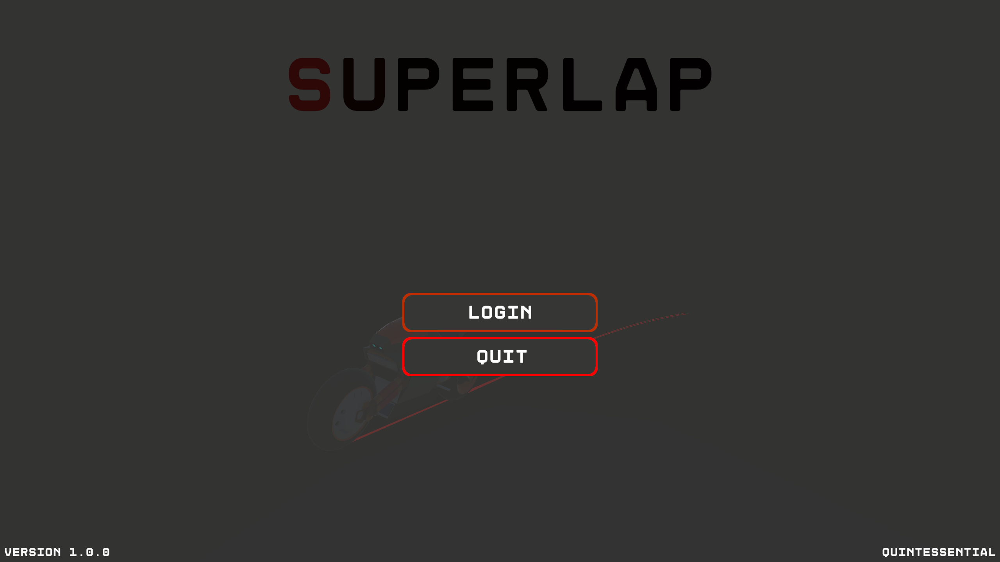
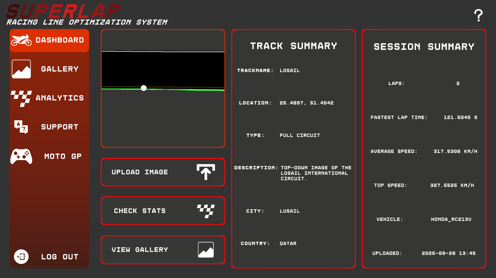
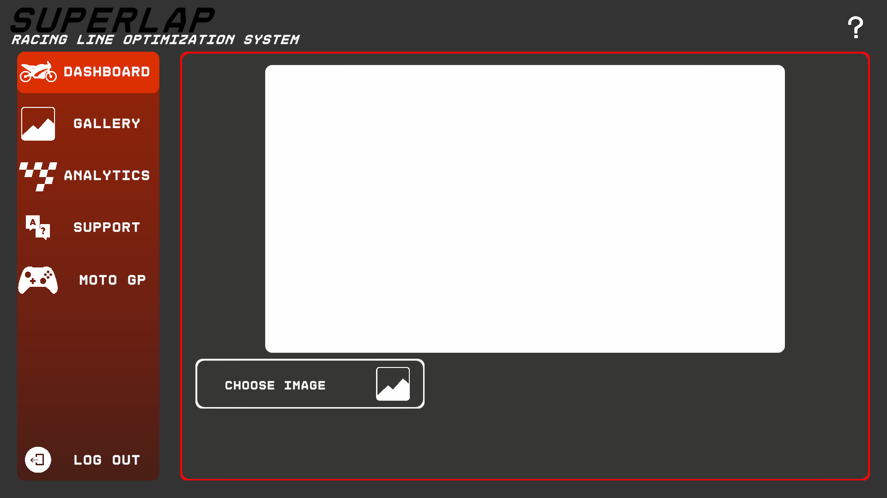
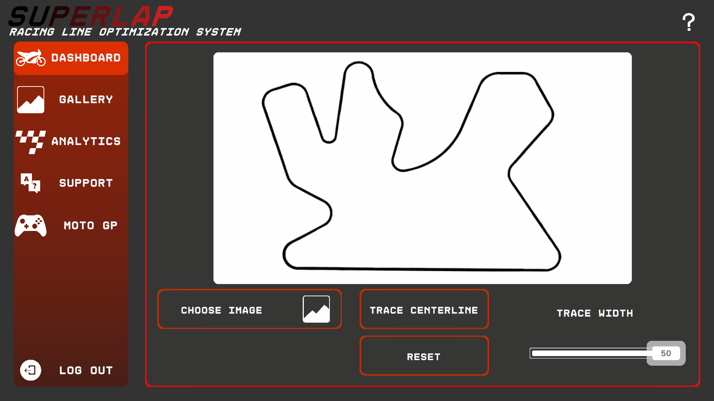
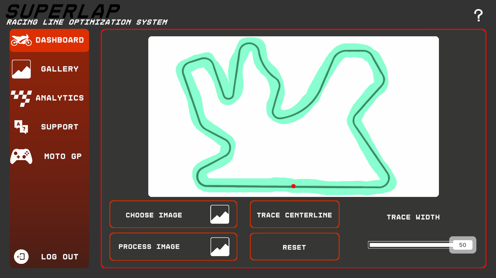

# How to login/register:
- When you launch SuperLap, you are greeted with the following page:  

- If you wish to login, click on the login page. 

- Now you can login with your existing username and password, or if you dont have an account, you can click the register button: 

- On the register page, enter your details as prompted and click register to complete registration: 

- Now you can go to the login page and login using the credentials you just setup.

# How to get an optimal racing line for any top down image of a track:
- On the dashboard tab you will see an upload image button. Click on it. 

- Now you should see an upload image button. Click it and select a track image from your disk in the file menu that pops up. 

- Now you should see the image you uploaded.
Click on trace centerline to draw a rough centerline on the track to ensure the image processor detects the track correctly. 

- Click on the process image button when you are happy with the centerline. 

- After Processing has finished, you will se the optimal racing line. 

- On this page you can see options to change cursor size, animation speed and trail lenght (All of these have to do with the creen spot you see on the image. It symbolizes you as the racer)

- You can also toggle the animation to see the full raceline. 

# Gallery and Analytics:
- In the Gallery tab, you will see a grid of already uploaded and processed tracks:  

- If you click on any of these tracks, you will be taken to the anylitics page of that track.  

- In the Analytics page, you can click on the opimized raceline to go to the view you saw at the end of processing your own racetrack.

# How to use Game integration (Moto GP tab)
## Installation:
- Buy and download MotoGP18 from steam: [MotoGP 18 Steam Page](https://store.steampowered.com/app/775900/MotoGP18/)
- Download Sim Racing Telemetry(SRT) from steam: [SRT Steam Page](https://store.steampowered.com/app/845210/Sim_Racing_Telemetry/)
- Buy the MotoGP18 DLC for SRT from steam: [Moto GP DLC](https://store.steampowered.com/app/885660/Sim_Racing_Telemetry__MotoGP_18/?curator_clanid=32708130)

## How to record laps in MotoGP
- Launch MotoGP18, navigate to any race you wish to do and enter the race.
- Launch SRT.
- Click on the MotoGP18 tile (Indicated by the arrow):  

- Click on the Record new Session Button (Indecated by the arrow):  

- Click on the Start Button (Indecated by the arrow):  

- Go back to MotoGP and start your race  

- While Racing you will see SRT recording your lap:  

- Once you are done with the race click the stop button in SRT

## How to export the recorded race from SRT to CSV:
- Click on the session you would like to export:  

- Click on the share button on the top right of the screen (Indicated by the arrow):  

- Click on the export to CSV option:  

- Save it to your disk from the file menu that popped up.

## How to import CSV's to SuperLap:
- Launch SuperLap and login then navigate to the MotoGP tab (Indicated by the arrow):  

- Click on the upload CSV option and go to the csv you saved in the file exlorer popup  

- Select the lap number you would like to analize, then click the Process buton  

- Look at the difference between your line and the uploaded line.  

- You will see the sliders change the thickness of the lines (Borders, Player line and optimal Race line)  
- You can zoom in on the track using the mouse scroll wheel, and you can move around the track by dragging your mouse.